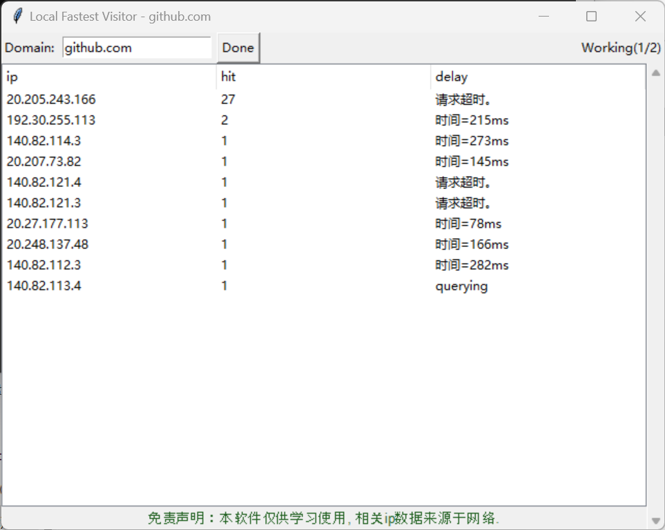

# FASTEST LOCAL VISITOR

找出全部域名对应的IP，并从中找出本地访问速度最快的哪个。
ping 128.0.0.xxx

### 技术简介
* 界面通过tk编写；
* 从网络的dns中解析到ip
* 根据本地ping结果显示到ui
* 点击列表项，修改到hosts文件

### 入口文件
main.py

### 开发
1. `git clone https://gitee.com/jeadyx/local-fastest-visitor.git`
2. `pip install -r requirements.txt`
3. `python main.py`

### 打包
```shell
pyinstaller main.spec
```

### 软件截图
